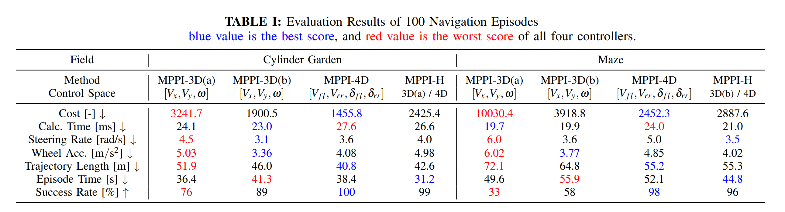
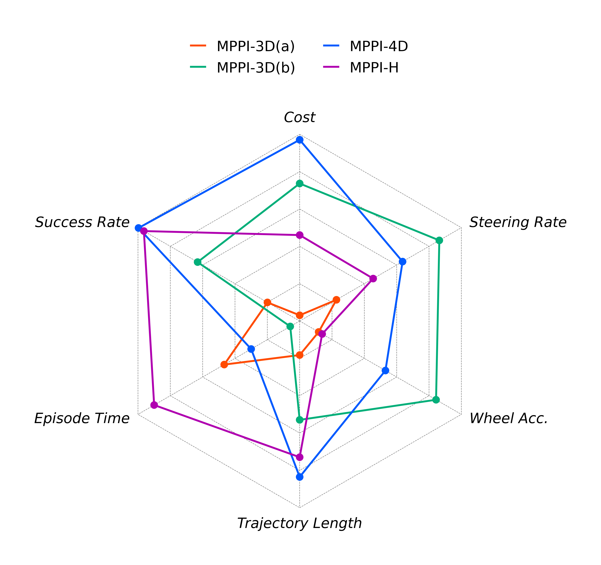
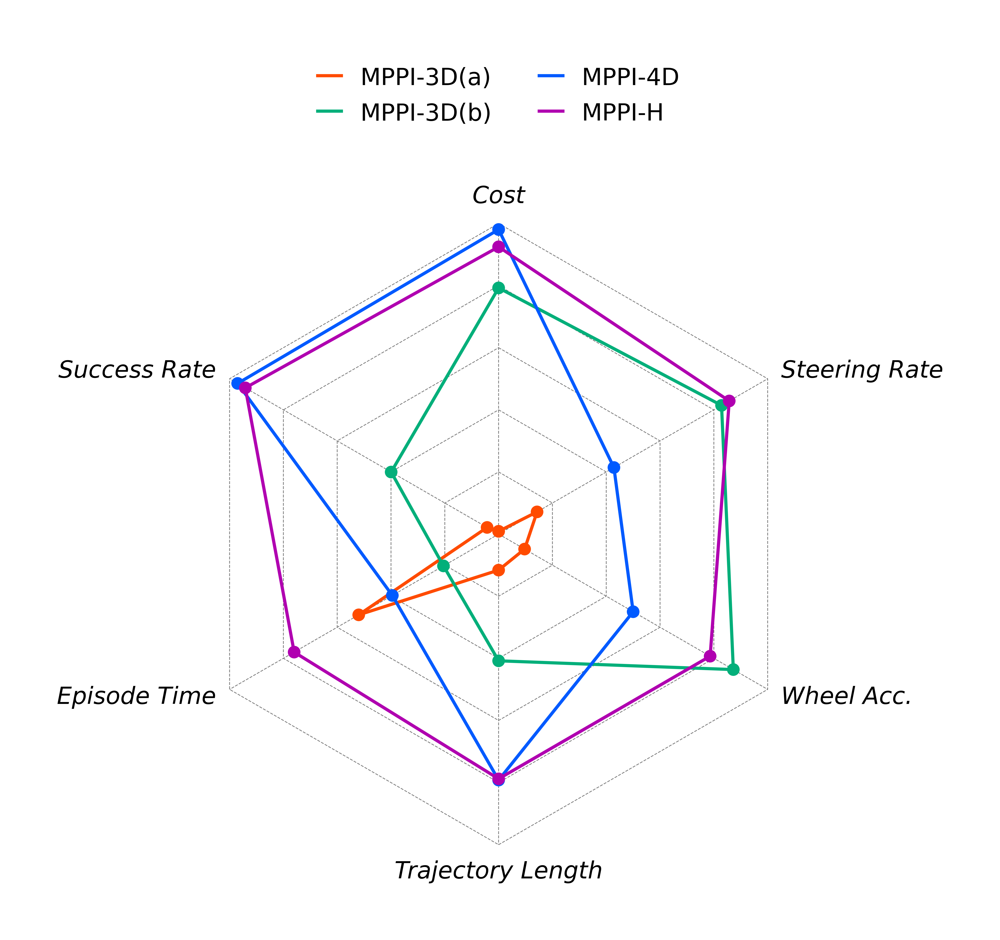

# Plotting Radar Chart with Python

[](https://opensource.org/licenses/MIT)
[](https://rye.astral.sh)

## Dependency

- [python](https://www.python.org/)
  - version 3.10 or higher is recommended.

- [rye](https://rye.astral.sh/)
  - seting up python environment easily and safely.
  - `numpy`, `matplotlib`, `notebook`, `pandas`, `pycirclize` are needed to run all scripts in this repository.

## Setup
```sh
git clone https://github.com/MizuhoAOKI/radar_chart.git
cd radar_chart
rye sync
```

## Usage

### Plot Radar Chart

```sh
cd radar_chart
rye run jupyter notebook notebooks/plot_iros2024_result.ipynb
```

Evaluation Data



Radar Chart of Cylinder Garden



Radar Chart of Maze



## Acknowledgement
I used [pyCirclize](https://moshi4.github.io/pyCirclize/) to plot the rader charts.

Thank you for developing such a useful visualization tool!
